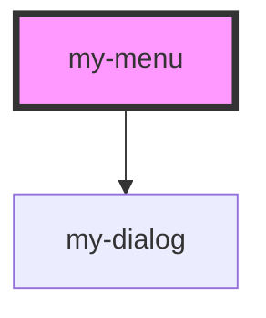

# my-menu

<!-- Auto Generated Below -->

## Events

| Event         | Description | Type               |
| ------------- | ----------- | ------------------ |
| `openUpdated` |             | `CustomEvent<any>` |

## Dependencies

### Depends on

- [my-dialog](../my-dialog)

### Graph

----------------------------------------------

*Built with [StencilJS](https://stenciljs.com/)*
